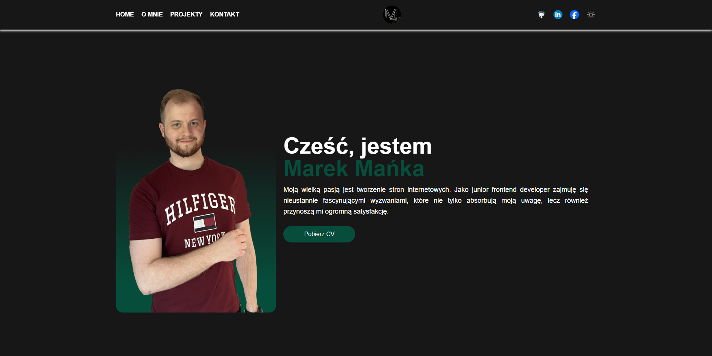

<table align="center">
    <tr>
        <td>
            
        </td>
    </tr>
</table>

# Website for my portfolio

To visit page click https://portfolio-marek-manka.netlify.app/ or clone locally and follow instructions given below.

Strona internetowa - portfolio stworzone w React i Tailwind CSS. Można tu znaleźć moje doświadczenie, umiejętności, informacje o mnie i zainteresowania. Przedstawiam także moje projekty, a do kontaktu można użyć moich social media lub formularza na stronie.

Portfolio website crafted with React and Tailwind CSS. Explore my experience, skills, personal information, and interests. Discover my showcased projects, and feel free to reach out through my social media or the provided contact form on the website. Thanks for visiting!

## Screenshot of the working page

## To run locally

npm i

npm run dev
